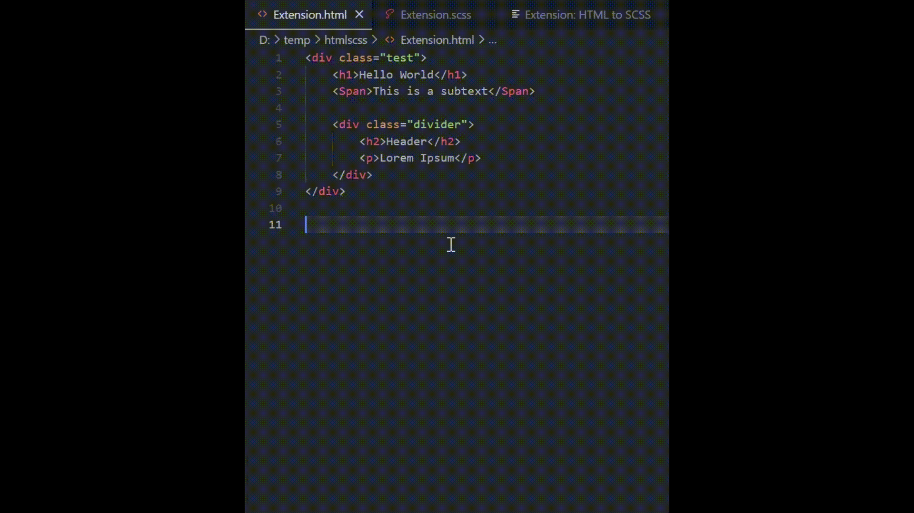

# HTML to SCSS

Transform your selected HTML snippet into a stunning SCSS structure with ease. Seamlessly generate clean and organized SCSS code from your HTML code.

## Features

- Generate SCSS from selected HTML: Convert an HTML snippet into SCSS code effortlessly.
- Clean and organized code: The generated SCSS code follows a structured and readable format.
- Clipboard integration: The SCSS code is automatically copied to the clipboard for easy access.

## Usage

1. Select the desired HTML snippet in the editor.
2. Right-click on the selection and choose "Generate SCSS from HTML" from the context menu
3. The extension will generate the corresponding SCSS code based on the HTML structure.
4. The SCSS code will be copied to the clipboard, ready for pasting into your scss file.

## Configuration

The HTML to SCSS extension provides a configuration option to customize the style of the generated SCSS code. By default, the extension uses the "Standard" style, which formats the SCSS code with opening brackets on the same line. However, you can change the output style to "Alman" where opening brackets are placed on a new line.

To modify the output style:

1. Open the Visual Studio Code settings (`Preferences > Settings` or `Ctrl + ,`).
2. Search for `HTML to SCSS` in the settings search bar.
3. Locate the `Output Style` option and select your preferred style: "standard" or "alman".
4. The extension will generate the SCSS code according to the selected style.

## Repository

The source code for this extension is available on [GitHub](https://github.com/DarioCasciato/vscode-html-to-scss). Contributions, bug reports, and feature requests are welcome.

## License

This extension is released under the [MIT License](LICENSE).

## Credits

This extension was developed by [Dario Casciato](https://github.com/DarioCasciato/).

[Buy me a espresso](https://buymeacoffee.com/dcasciato0s)
